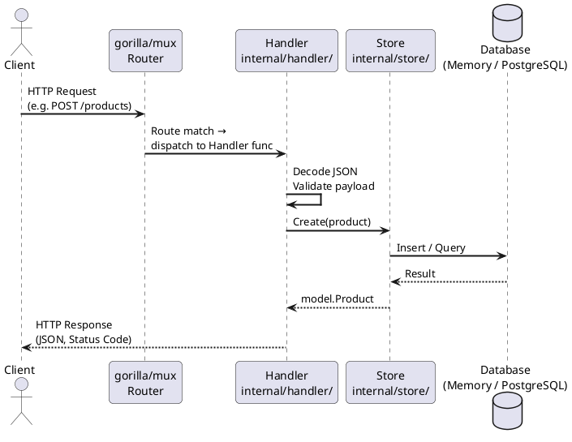

# Architecture – Product Catalog API

## Request Flow

### Schichten

| Schicht | Paket | Aufgabe |
|---------|-------|---------|
| **Router** | `gorilla/mux` (in `cmd/api/main.go`) | Registriert URL-Patterns auf Handler-Funktionen (`RegisterRoutes`). Parst auch URL-Parameter wie `{id:[0-9]+}`. |
| **Handler** | `internal/handler/` | Dekodiert den JSON-Request-Body, validiert die Eingabe (`p.Validate()`), ruft den Store auf und schreibt die JSON-Antwort mit dem passenden HTTP-Statuscode zurück. |
| **Store** | `internal/store/` | Kapselt den gesamten Datenzugriff hinter einem einheitlichen Interface (`GetAll`, `GetByID`, `Create`, `Update`, `Delete`). Zwei Implementierungen: `MemoryStore` und `PostgresStore`. |
| **Database** | — | Entweder eine in-memory `map[int]model.Product` (kein externer Prozess nötig) oder eine PostgreSQL-Instanz (via Docker Compose). |

---

## MemoryStore vs. PostgresStore

| | MemoryStore | PostgresStore |
|---|---|---|
| **Persistenz** | Nein – Daten gehen bei Neustart verloren | Ja – Daten bleiben in PostgreSQL erhalten |
| **Einsatz** | Unit-Tests, lokale Entwicklung ohne Docker | Produktion, Integrationstests mit Docker Compose |
| **Abhängigkeit** | Keine externe DB nötig | PostgreSQL muss laufen (z. B. via `docker compose up`) |
| **Threadsicherheit** | `sync.RWMutex` im Store selbst | DB-seitig (PostgreSQL garantiert ACID) |
| **Startzeit** | Sofort | Wartezeit bis DB bereit ist (`db.Ping()`) |

### Wann welchen Store?

- **MemoryStore** → während der Entwicklung und für Handler-Unit-Tests (`handler_test.go` nutzt ihn ausschließlich), weil kein externer Prozess gebraucht wird.
- **PostgresStore** → in Docker Compose (`DB_HOST` gesetzt) und in Produktion, weil Daten nach einem Container-Neustart noch vorhanden sein müssen.

`main.go` wählt den Store automatisch: wenn `DB_HOST` als Umgebungsvariable gesetzt ist, wird `PostgresStore` verwendet, sonst `MemoryStore`.
